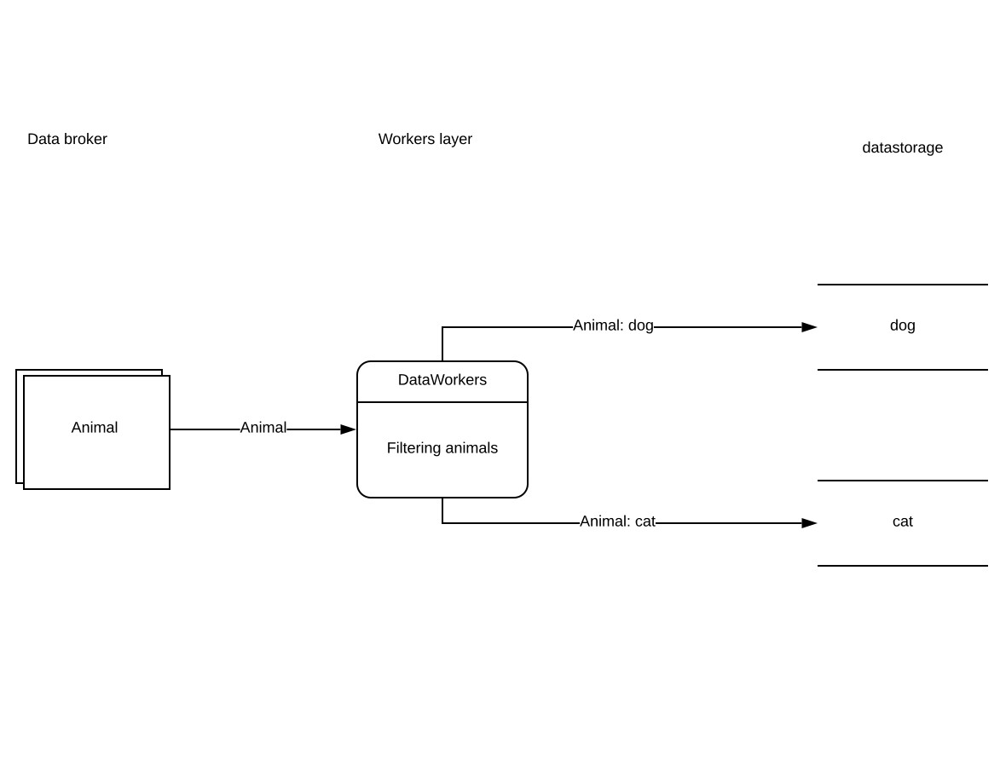

# datastorage
Provides API-service for arranging data storages with various structure and supports CRUD-operation for those storages.
Each storage is created by declarative structure and has endpoint for all operations. Endpoint for accessing storage supports 
pagination, filtering and protection against concurrent updating (optimistic locking).
This projects has been built on:

* Django

* rest_framework

* Celery

* Postgres

Used tools:

* validating requests by json-schema

* build models and other classes by type-factories

* build api based on DRF viewsets


As demo project too many things are simplified :) But it doesn't matter it could be made better.

# Problem

In the situations when something generates big and unstructured events the endpoint data can be a pain for receivers that need to 
 work with objects that have certain and defined structure. For example process of selling products on onlain shops can have too much data, and certain consumer needs only data about product and when it has been sold. And other data about price, customer and etc is not important for this consumer. But let's see another process:
 

 
This diagram shows how some data broker is getting too many unstructured items about new animal that contain thousand of fields. Let say that's central animal ministry :D And after some worker is reading all those items and filtering and preparing the data by two types of animal - dogs and cats and selects important attributes for those animal species. After filtration this worker stores the prepared data to separated storages for this two types. **And this project helps to operate such storages.** All those two storages can get new or updated information from other sources, and also have too many consumers.

# Requirements

* api for creation storages
  
    * primary key type
    * indexes type
    * data fields
    
* each storage should be implemented in separated table

* migrations with backward compatibility, versions of changes

* automatic validation of data by storage structure

* Protection against concurrent changing of data

As demo project some functionality is simplified: it will support only few types: int, long, string and text, all the fields should be required, supports only backward compatibility and doesn't support changing of previous data structure.


# Implementation

## Solution overview

This solution solves the problem when some processes require certain storage to save data with defined schema. Each 
storage can validate incoming data and store it to database. Any recipients can get the data from those storages and operate
with this somehow. The storage support changing schemas, but new schema should have backward compatibility with previous one.
That means you can only add new fields with default value. All the old data will be updated with this new field and value. 
Of cource, for test project it doesn't support various types, for first version it's integer and text types.

In our example with animals we need to create two storages for dogs and cats.

Storage for dogs can have the next atributes:

* chip_id - unique identifier

* color - string describes the color, need to filter by this field

* collar_size - integer describes collar size in cm

for cats:

* chip_id - unique identifier

* color - string describes the color, need to filter by this field

* description - text describes a cat shape

For application declaration such entities have the next definitions:

dog 

```
{
    "name": "dog",
    "key": {"name": "chip_id", "type": "string", "max_length": 16},
    "fields": [
        {"name": "color", "type": "string", "max_length": 32, "db_index": true},
        {"name": "collar_size", "type": "integer"}        
    ]
}
```

cat

```
{
    "name": "cat",
    "key": {"name": "chip_id", "type": "string", "max_length": 16},
    "fields": [
        {"name": "color", "type": "string", "max_length": 32, "db_index": true},
        {"name": "description", "type": "text"}        
    ]
}
```
Storages can be created with the next endpoint of storage factory:

```
curl -X POST http://127.0.0.1:8010/api/v1/factory/storage/ -H "Content-Type: application/json" -d '<cat and/or dog definition>'
```

Storages have been created! To operate this storage there are new endpoints appeared:

http://127.0.0.1:8010/api/v1/storage/dog/

Data example:

```
{
    "chip_id": "CHIP1",
    "color": "red",
    "collar_size": 40
}
```

* http://127.0.0.1:8010/api/v1/storage/cat/

Data example:

```
{
    "chip_id": "CHIP2",
    "color": "red",
    "collar_size": 40
}
```

All such endpoints support GET, POST methods for list and create fields. If field defined as db_index it is available as filter field 
as query argument (also list can be filtered by key field). To access item by id you can use http://127.0.0.1:8010/api/v1/storage/god/<chip_id>/ and there are methods PUT, GET and DELETE allowed.

# API

### GET /api/v1/factory/storage/

List of all storage items. 

**Query params**

* limit - integer, the maximum number of items to return

* offset - integer, the starting position of the query

**Response**

<details><summary>200 OK Content-Type: application/json</summary>
 
 ```
 {
    "count": 2,
    "next": null,
    "previous": null,
    "results": [
        {
            "name": "dog",
            "version": 2,
            "locked": false,
            "definition": {
                "key": {
                    "name": "chip_id",
                    "type": "string",
                    "max_length": 16
                },
                "fields": [
                    {
                        "name": "color",
                        "type": "string",
                        "db_index": true,
                        "max_length": 32
                    },
                    {
                        "name": "collar_size",
                        "type": "integer"
                    }
                ]
            },
            "created_at": "2019-12-29T13:23:30.982711Z",
            "updated_at": "2019-12-29T13:23:30.982739Z"
        },
        {
            "name": "cat",
            "version": 1,
            "locked": false,
            "definition": {
                "key": {
                    "name": "chip_id",
                    "type": "string",
                    "max_length": 16
                },
                "fields": [
                    {
                        "name": "color",
                        "type": "string",
                        "db_index": true,
                        "max_length": 32
                    },
                    {
                        "name": "description",
                        "type": "text"
                    }
                ]
            },
            "created_at": "2019-12-28T20:15:39.382721Z",
            "updated_at": "2019-12-28T20:15:39.382762Z"
        }
    ]
}
 ```

</details>

### POST /api/v1/factory/storage/

Create or create of new version of storage. 

**Header**

> Content-Type: application/json

<details><summary>Schema</summary>

```
{
    "type": "object",
    "properties": {
        "name": {"type": "string", "minLength": 1, "maxLength": 255},
        "key": {
            "oneOf": [
                {
                    "type": "object",
                    "properties": {
                        "name": {"type": "string", "minLength": 1, "maxLength": 128},
                        "type": {"type": "string", "enum": ["integer", "long"]}
                    },
                    "required": ["name", "type"]
                },
                {
                    "type": "object",
                    "properties": {
                        "name": {"type": "string", "minLength": 1, "maxLength": 128},
                        "type": {"type": "string", "enum": ["string"]},
                        "max_length": {"type": "integer", "minimum": 1, "maximum": 1024}
                    },
                    "required": ["name", "type", "max_length"]
                }
            ]
        },
        "fields": {
            "type": "array",
            "minItems": 1,
            "items": {
                "oneOf": <see field definitions below>
            }
        },
        "meta": {
            "type": "object",
            "properties": {
                "unique_together": {
                    "type": "array",
                    "minItems": 1,
                    "items": [
                        {
                            "type": "array",
                            "minItems": 2,
                            "items": [
                                {"type": "string", "minLength": 2, "maxLength": 128}
                            ]
                        }
                    ]
                }
            }
        }
    },
    "additionalProperties": false,
    "required": ["name", "key", "fields"]
}
```

</details>

#### Field definitions

##### integer

<details><summary>Integer field</summary>

```
{
    "type": "object",
    "properties": {
        "name": {"type": "string", "minLength": 2, "maxLength": 128},
        "type": {"type": "string", "enum": ["integer"]},
        "db_index": {"type": "boolean", "default": False},
        "default": {"type": "integer", "minimum": 0}
    },
    "additionalProperties": false,
    "required": ["name", "type"]
}
```

</details>

<details><summary>Example</summary>

```
{"name": "fieldname", "type": "integer", "db_index": true, "default": 1}
```

</details>

##### long

<details><summary>Long field</summary>

```
{
    "type": "object",
    "properties": {
        "name": {"type": "string", "minLength": 2, "maxLength": 128},
        "type": {"type": "string", "enum": ["long"]},
        "db_index": {"type": "boolean", "default": False},
        "default": {"type": "integer", "minimum": 0}
    },
    "additionalProperties": false,
    "required": ["name", "type"]
}
```

</details>

<details><summary>Example</summary>

```
{"name": "fieldname", "type": "long", "db_index": true, "default": 1}
```

</details>


##### string

<details><summary>String field</summary>

```
{
    "type": "object",
    "properties": {
        "name": {"type": "string", "minLength": 2, "maxLength": 128},
        "type": {"type": "string", "enum": ["string"]},
        "max_length": {"type": "integer", "minimum": 1, "maximum": 1024},
        "db_index": {"type": "boolean", "default": False},
        "default": {"type": "string", "minLength": 0}
    },
    "additionalProperties": false,
    "required": ["name", "type", "max_length"]
}
```

</details>

<details><summary>Example</summary>

```
{"name": "fieldname", "type": "string", "max_length": 16, "db_index": true, "default": "s"}
```

</details>

##### text

<details><summary>Text field</summary>

```
{
    "type": "object",
    "properties": {
        "name": {"type": "string", "minLength": 2, "maxLength": 128},
        "type": {"type": "string", "enum": ["text"]},
        "default": {"type": "string", "minLength": 0}
    },
    "additionalProperties": False,
    "required": ["name", "type"]
}
```

</details>

<details><summary>Example</summary>

```
{"name": "fieldname", "type": "string", "default": "s"}
```

</details>


**Query example (with fields)**

<details><summary>Example</summary>
 
 ```
 {
    "name": "dog",
    "key": {"name": "chip_id", "type": "string", "max_length": 16},
    "fields": [
        {"name": "color", "type": "string", "max_length": 32, "db_index": true},
        {"name": "collar_size", "type": "integer"}        
    ]
}
 ```

</details>

*In case of updating storage if it already exists in factory you need to make the similar query, but add to "fields" section new wield 
definitions with argument "default". As result you will get new version of storage ("version" field will be incremented)*

**Response**

<details><summary>201 CREATED Content-Type: application/json</summary>
 
 ```
 {
    "name": "dog",
    "version": 1,
    "locked": true,
    "definition": {
        "key": {
            "name": "chip_id",
            "type": "string",
            "max_length": 16
        },
        "fields": [
            {
                "name": "color",
                "type": "string",
                "max_length": 32,
                "db_index": true
            },
            {
                "name": "collar_size",
                "type": "integer"
            }
        ]
    },
    "created_at": "2019-12-29T13:23:30.982711Z",
    "updated_at": "2019-12-29T13:23:30.982739Z"
}
 ```

</details>

<details><summary>400 Bad request Content-Type: application/json</summary>
 
 ```
 {
    "detail": "Error detail message"
}
 ```

</details>

### GET /api/v1/factory/storage/{storage_name}/

Detailed information about storage

**Response**

<details><summary>200 OK Content-Type: application/json</summary>
 
 ```
 {
    "name": "dog",
    "version": 2,
    "locked": false,
    "definition": {
        "key": {
            "name": "chip_id",
            "type": "string",
            "max_length": 16
        },
        "fields": [
            {
                "name": "color",
                "type": "string",
                "db_index": true,
                "max_length": 32
            },
            {
                "name": "collar_size",
                "type": "integer"
            }
        ]
    },
    "created_at": "2019-12-29T13:23:30.982711Z",
    "updated_at": "2019-12-29T13:23:30.982739Z"
}
 ```

</details>

### GET /api/v1/factory/ready_status/{storage_name}/

Get information about storage creation status. If all migration performed successfuly the applied status will be true, if something
 went wrong or migrations are still performing status will be false
 
<details><summary>200 OK Content-Type: application/json</summary>
 
 ```
 {
    "name": "dog",
    "version": 2,
    "applied": true
}
 ```

</details>

### GET /api/v1/storage/{storage_name}/

List of storage's items. 

**Query params**

* limit - integer, the maximum number of items to return

* offset - integer, the starting position of the query

* all the fields defined as db_index, key, created_at, updated_at. created_at and update_at are expected to support lte, gte soon 

**Response**

<details><summary>200 OK Content-Type: application/json</summary>
 
 ```
 {
    "count": 1,
    "next": null,
    "previous": null,
    "results": [
        {
            "chip_id": "CHIP01A",
            "color": "red",
            "collar_size": 40,
            "version": 1,
            "created_at": "2019-12-29T19:08:53.644833Z",
            "updated_at": "2019-12-29T19:08:53.644891Z"
        }
    ]
}
 ```

</details>

<details><summary>409 Conflict Content-Type: application/json</summary>
 
 ```
 {
    "detail": "Error detail message"
}
 ```

</details>

### POST /api/v1/storage/{storage_name}/

Create a new version of data

**Request data description**

* All the fields and key defined on storage. Fields with argument default can be passed, in this case default value will set.

* version - field for control concurrent request. This field is not required, then it will be set as 1 if version didn't exist before.
 But in case if another value is countable it has sense to set this value of last version you have. In case if another request happened and version incremented in database you will get HTTP 409 Conflict error.

**Query example**

<details><summary>Example</summary>
 
 ```
 {
    "chip_id": "CHIP01A",
    "color": "red",
    "collar_size": 40,
    "version": 1
}
 ```

</details>

*In case of updating storage if it already exists in factory you need to make the similar query, but add to "fields" section new wield 
definitions with argument "default". As result you will get new version of storage ("version" field will be incremented)*

**Response**

<details><summary>201 CREATED Content-Type: application/json</summary>
 
 ```
 {
    "chip_id": "CHIP01A",
    "color": "red",
    "collar_size": 40,
    "version": 2,
    "created_at": "2019-12-29T19:08:53.644833Z",
    "updated_at": "2019-12-29T19:19:25.280698Z"
}
 ```

</details>

<details><summary>400 Bad request Content-Type: application/json</summary>
 
 ```
 {
    "detail": "Error detail message"
}
 ```

</details>


<details><summary>409 Conflict Content-Type: application/json</summary>
 
 ```
 {
    "detail": "Error detail message"
}
 ```

</details>

### GET /api/v1/storage/{storage_name}/{key}/

Detailed information about storage's item

**Response**

<details><summary>200 OK Content-Type: application/json</summary>
 
 ```
 {
    "chip_id": "CHIP01A",
    "color": "red",
    "collar_size": 40,
    "version": 2,
    "created_at": "2019-12-29T19:08:53.644833Z",
    "updated_at": "2019-12-29T19:19:25.280698Z"
}
 ```

</details>

<details><summary>409 Conflict Content-Type: application/json</summary>
 
 ```
 {
    "detail": "Error detail message"
}
 ```

</details>


### DELETE /api/v1/storage/{storage_name}/{key}/

Delete storage's item

<details><summary>204 No content Content-Type: application/json</summary>
 
 ```
 ```

</details>

<details><summary>409 Conflict Content-Type: application/json</summary>
 
 ```
 {
    "detail": "Error detail message"
}
 ```

</details>


# Run example

To run application simply you can use built in docker settings. From the root of repo directory run the next command:

> docker-compose build

> docker-compose up

The project will be available on address 

> http://localhost:8010/

(Sorry for the mess with docker files, my home devices aren't for development and work on windows, don't want to dig why pathes don't work properly)


# development environment

Project settings can be redefined with file settings_local.py in directory src/datastorage.

Before attempts to run the project the next steps can help:

>cd dev

>docker-compose up

Thhis docker setting run database and other environment for the project.

For running application there are the next steps:

Build environment on python3.6

> virtualenv dsenv --no-site-packages

Apply environment

> . dsenv/bin/activate

Install python packages

> pip install -r src/requirements.txt

Go to app directory 

>cd src/datastorage

Run migrations

> python manage.py migrate

Start application

> python manage.py runserver

In other terminal window activate environment and run celery worker:

> celery -A datastorage worker -l debug

# testing

In your applied dev environment install tox

> pip install tox

Run tox

> tox

# src structure

* dev - helper tools for development. Contains docker-compose file for development environment

* docker - contains settings for docker demo environment 

* src - source code

    * datastorage - Django project folder
 
        * factory - application implement logic for storing storages and perfrom migrations of those
  
        * storage - generic tool for working with saved storages
  
        * utils - helpers and overriden logic

